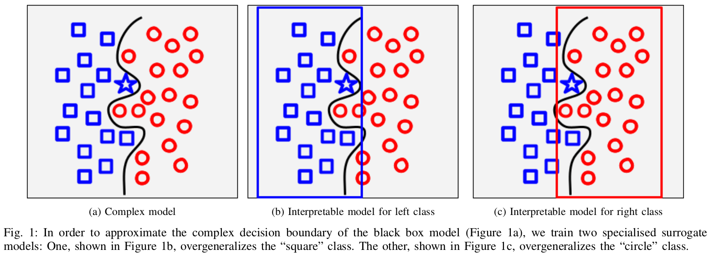

# STACI

**S**urrogate **T**rees for **A** posteriori **C**onfident **I**nterpretations.

STACI interpretation of Black Box classifiers using multiple surrogate Decision Trees.




## Usage

Download the code and import STACI:

```from staci import *```


To train the explainer, use the following code:

```explainer = STACISurrogates(max_depth=depth)```

```max_depth``` decides the maximum length of the interpretation (e.g. the depth of Decision Tree)

```explainer.fit(trainDf, y_pred_df, black_box, features=attrs, target='target')```

To explain the instance: 

```exp, ratio = explainer.verbose_predict(instance, y_pred_sample, features)```

